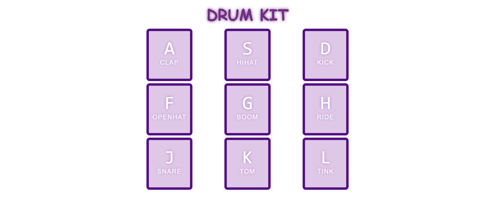

# responsive-drum-kit
Drum Kit Project

This Drum Kit project is a simple JavaScript application that allows users to play music by pressing specific keyboard keys, clicking with the mouse, or tapping on a mobile device.

The project is inspired by the JavaScript30 challenge by Wes Bos.

Features:

-Keyboard Input: Press designated keys on your computer keyboard to produce drum sounds.

-Mouse Clicks: Click on the visual representations of drums on the screen to play corresponding sounds.

-Mobile Touch Support: Experience the drum kit on your mobile device by tapping on the drum visuals.

Usage:

-Keyboard: Press the keys displayed on the screen, typically corresponding to drum sounds.

-Mouse: Click on the drum visuals on the screen to trigger the associated sounds.

-Mobile: On touch-enabled devices, tap on the drum visuals to play the sounds.

https://654e555f3e992c28a6a290d8--bright-duckanoo-ededd2.netlify.app/

